<!-- _class: sec -->

# GPU-Accelerated Awkward Arrays with CUDA Python

## How do you compile high-level Python operations on irregular data into efficient GPU kernels?

Ianna Osborne (Princeton) · **Ashwin Srinath** (NVIDIA) · SciPy 2026


---

## Scientific data isn't rectangular

<div class="cols even">
<style scoped>
.cols > div { display: flex; flex-direction: column; justify-content: center; }
</style>

<div class="cols">
<div>

<span class="cur">NumPy</span>

```text
● ● ● □ □
● □ □ □ □
● ● ● ● ●
```

❌ Padding

</div>
<div>

<span class="cur">Awkward Array</span>

```text
● ● ●
●
● ● ● ● ●
```

✅ No padding

</div>
</div>

<center>

**Same data. Different representation.**

</center>

---

## GPUs prefer regular work

<div class="cols even">
<style scoped>
.cols > div { display: flex; flex-direction: column; justify-content: center; }
.cols pre code { line-height: 1.6; letter-spacing: 3px; }
</style>

<div class="cols">
<div>

<span class="cur">Traditional GPU algorithms assume</span>

```
□□□□□
□□□□□
□□□□□
□□□□□
...
```

</div>
<div>

<span class="cur">Jagged arrays break this assumption</span>

```
□□□
□
□□□□□□
□□
...
```

</div>
</div>

<center>

**Uneven work per thread limits GPU efficiency.**

</center>

---

## Awkward Array

<style scoped>
img { display: block; margin: auto; }
</style>

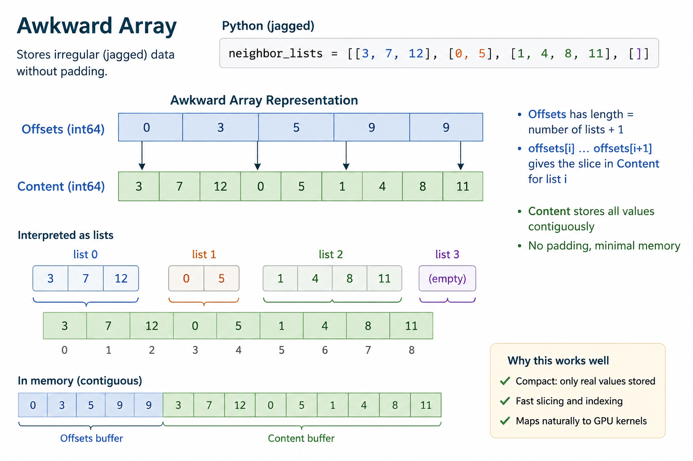

---

## Storage solved

<style>
.pipeline {
  display: flex;
  flex-direction: column;
  align-items: center;
  margin-top: 12px;
}

.python {
  width: 360px;
  padding: 10px 14px;
  border: 2px solid #4f8edc;
  border-radius: 10px;
  background: #eef6ff;
  text-align: center;
}

.python pre {
  margin: 0;
  font-size: 24px;
}

.arrow {
  margin: 4px 0;
  font-size: 34px;
  line-height: 1;
  color: #666;
}

.storage {
  width: 860px;
  padding: 16px 24px 10px 24px;
  border: 2px solid #666;
  border-radius: 12px;
  background: white;
}

.label {
  margin: 4px 0 8px 0;
  text-align: center;
  font-size: 21px;
  font-weight: 700;
  color: #444;
}

.memory {
  margin: 0 auto 14px auto;
  border-collapse: collapse;
}

.memory td {
  width: 96px;
  height: 48px;
  border: 2px solid #4f8edc;
  background: #eef6ff;
  text-align: center;
  vertical-align: middle;
  font-size: 21px;
  font-weight: 700;
}

.offsets td {
  width: 68px;
  border-color: #4caf50;
  background: #eef9ee;
}

.guides {
  display: grid;
  grid-template-columns: repeat(6, 96px);
  justify-content: center;
  margin: -4px auto 4px auto;
  font-size: 17px;
  color: #58717a;
}

.guides span {
  text-align: left;
}

.guides .g0 { grid-column: 1; }
.guides .g3 { grid-column: 4; }
.guides .g4 { grid-column: 5; }
.guides .g6 {
  grid-column: 6;
  text-align: right;
}

.takeaway {
  margin-top: 6px;
  text-align: center;
  font-size: 25px;
  line-height: 1.3;
  font-weight: 700;
  color: #2e7d32;
}
</style>

<div class="pipeline">

<div class="python fragment">

```python
events.muons.pt
```
</div>
<div class="arrow fragment">↓</div>
<div class="storage">
<div class="fragment">
<div class="guides fragment">
<span class="g0">0 ↓</span>
<span class="g3">3 ↓</span>
<span class="g4">4 ↓</span>
<span class="g6">6 ↓</span>
</div>
<div class="label">content — Muon p<sub>T</sub> [GeV]</div>
<table class="memory"> 
<tr> 
<td>18.7</td> 
<td>42.1</td> 
<td>27.5</td> 
<td>11.3</td> 
<td>63.8</td> 
<td>34.2</td> 
</tr> 
</table> 
</div>
<div class="fragment">
<div class="label">offsets</div>
<table class="memory offsets"> 
<tr> <td>0</td> <td>3</td> <td>4</td> <td>6</td> </tr>
</table>
</div>
</div>
<div class="arrow fragment">↓</div>
<div class="takeaway fragment"> ✓ No padding<br> ✓ Compact contiguous memory </div>
</div>


---

## But execution...

<div class="pipeline">

<div class="step fragment">
  <div class="box kernel">Kernel</div>
  <div class="arrow">↓</div>
</div>

<div class="step fragment">
  <div class="box memory">Global memory</div>
  <div class="arrow">↓</div>
</div>

<div class="step fragment">
  <div class="box kernel">Kernel</div>
  <div class="arrow">↓</div>
</div>

<div class="step fragment">
  <div class="box memory">Global memory</div>
</div>

</div>

<div class="takeaway fragment">

> **Intermediate arrays increase memory traffic and dominate runtime.**

</div>

<style>
.pipeline {
  display: flex;
  flex-direction: column;
  align-items: center;
  margin-top: 28px;
}

.step {
  display: flex;
  flex-direction: column;
  align-items: center;
}

.box {
  width: 280px;
  padding: 14px 20px;
  border-radius: 10px;
  text-align: center;
  font-size: 28px;
  font-weight: 700;
}

.kernel {
  background: #eaf4d8;
  border: 2px solid #76b900;
  color: #17303a;
}

.memory {
  background: #eef3f5;
  border: 2px solid #9fb3bb;
  color: #17303a;
}

.arrow {
  font-size: 34px;
  line-height: 1;
  margin: 6px 0;
  color: #58717a;
}

.takeaway {
  margin-top: 30px;
  text-align: center;
  font-size: 28px;
}
</style>

---

<!-- _class: challenge -->

## The challenge

<div class="challenge-question">

Can we compile an entire Awkward computation  
into one optimized GPU program?

</div>

<style>
section.challenge {
  display: flex;
  flex-direction: column;
  justify-content: center !important;
  align-items: center;
  text-align: center;
}

section.challenge h1 {
  margin-bottom: 48px;
}

.challenge-question {
  max-width: 980px;
  font-size: 42px;
  line-height: 1.25;
  font-weight: 700;
  color: #123f4d;
}
</style>

---

<!--
cc is one of many libraries in the "CUDA Python" ecosystem.

A collection of libraries exposing the capabilities of CUDA to Python developers that were previously only available from C or C++.

cuda-core and cuda-bindings 
- let you work directly with the CUDA runtime and driver and let you:
  - allocate GPU memory
  - schedule work on the GPU
  - compile CUDA programs

nvmath-python provides optimized linear algebra, random numbers, and FFTs.

numba-cuda and cuda-tile lets you write functions that execute in parallel on the GPU (we call these kernels).


Writing kernels requires some CUDA expertise. That's why we have cuda.compute - it's a library that lets you write custom functionality using higher-level tooling. It doesn't require any CUDA-specific knowledge. Let's see an example of what cuda.compute looks like.

-->
<!-- ASHWIN:BEGIN -->

## What is `cuda.compute`?

<div class="cols">
<div>

- <span class="cur">One of several libraries in **CUDA Python**</span>

</div>
<div>

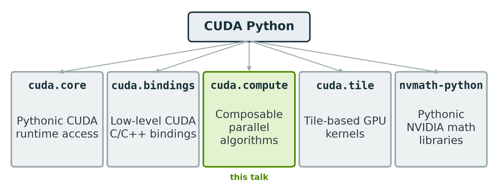

<div class="note" style="text-align:center"><a href="https://nvidia.github.io/cuda-python/" style="color:#6f93d6">https://nvidia.github.io/cuda-python/</a></div>

</div>
</div>


---

## What is `cuda.compute`?


---

<!--
In this code example, we have a CuPy array that we want to sort, but we don't want a regular numeric sort. Instead we want to sort by the last digit.

To do this with cuda.compute we can use the merge_sort function, and provide a custom comparator defined as a Python lambda. That comparator tells cuda.compute how to compare any two values.

At the end, the output array holds the sorted values and you can see they are sorted by the last digit.

This is a very simple example, but it shows a few important features of cuda.compute

- first, cuda.compute isn't an array or tensor frameworks. Instead, you can pass cupy arrays or pytorch tensors etc to it as the input and output arguments. It's meant to be used WITH these libraries.
- second, a major feature of cuda.compute is that it's composed of generic algorithms. We implemented one kind of sort here, but you can provide a different comparator. It's designed to be flexible.
-->


<div class="cols">
<div>

- <span class="past">One of several libraries in **CUDA Python**</span>
- <span class="cur">Lets you build **custom algorithms**</span>

</div>
<div>

```python
import cupy as cp
from cuda.compute import merge_sort

data_in  = cp.array([13, 41, 22, 8, 95, 34])
data_out = cp.empty_like(data_in)

# sort by the last digit: a custom comparator, in Python
merge_sort(d_in_keys=data_in, d_out_keys=data_out,
           num_items=data_in.size,
           op=lambda a, b: a % 10 < b % 10)

# data_out -> [41, 22, 13, 34, 95, 8]
```

</div>
</div>


---

## What is `cuda.compute`?

<!--
In terms of level of abstraction, cuda.compute sits somewhere between high-level array or tensor libraries and low-level CUDA/C++ code. If you look underneath CuPy or PyTorch today, you'll see a significant amount of CUDA C++ code. The goal of cuda.compute is to eliminate the need for architecting libraries in this way, and keep things in pure Python.
-->


<div class="cols">
<div>

- <span class="past">One of several libraries in **CUDA Python**</span>
- <span class="past">Lets you build **custom algorithms**</span>
- <span class="cur">Sits **below** the array / tensor frameworks</span>

</div>
<div>

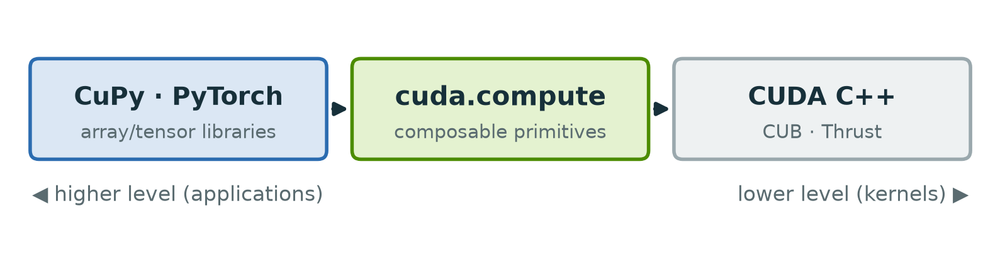

</div>
</div>


---

## What is `cuda.compute`?


<!--
cuda.compute takes its inspiration from C++ algorithms and iterators. The code snippet on top shows how you would compute sum of squares using the Thrust C++ library. On the bottom is the equivalent Python. The similarity doesn't end with just the design. In fact the Python program is ultimately going to call down to the exact same CUDA kernels as the Thrust program and you should expect to see identical performance between the two.
-->


<div class="cols">
<div>

- <span class="past">One of several libraries in **CUDA Python**</span>
- <span class="past">Lets you build **custom algorithms**</span>
- <span class="past">Sits **below** the array / tensor frameworks</span>
- <span class="cur">Inspired by **C++**: generic algorithms and iterators</span>

</div>
<div>

<div class="aot-h">CUDA C++ / Thrust</div>

```cpp
auto squares = thrust::make_transform_iterator(
    thrust::counting_iterator<int>(0),
    [] __device__ (int i) { return i * i; });

int total = thrust::reduce(squares, squares + n,
                           0, thrust::plus<int>());
```

<div class="aot-h aot-gap">cuda.compute (Python)</div>

```python
squares = TransformIterator(CountingIterator(0),
                            lambda i: i * i)
reduce_into(d_in=squares, d_out=out, num_items=n,
            op=OpKind.PLUS, h_init=np.zeros(1))
```

</div>
</div>


---

## `cuda.compute` features

<!--
At its core, `cuda.compute` is a collection of algorithms, like reduce, scan, sort, and transform. And while you don't see it, the implementation of these algorithms is in CUDA C++. That code is painstakingly optimized and tuned for every CUDA architecture supported by NVIDIA so you're guaranteed to see best-in-class performance no matter where you run them (and with no tuning efforts on your part).

As we saw before with the sorting-by-last-digit example, these algorithms are highly generic so you can customize them and combine them in clever ways to solve the problem at hand.
-->

<div class="cols">
<div>

- <span class="cur">**Algorithms**: composable parallel building blocks (CUB and Thrust)</span>

</div>
<div>

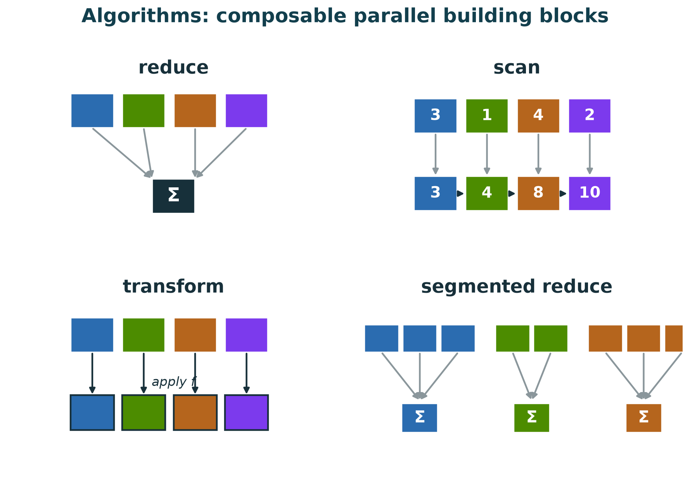

</div>
</div>


---

## `cuda.compute` features

<!--
The other important concept in cuda.compute is iterators. Not to be confused with Python iterators (but similar in spirit). Iterators represent sequences that occupy no physical GPU memory. Instead, their values are computed on the fly during kernel execution.

Some examples..
-->

<div class="cols">
<div>

- <span class="past">**Algorithms**: composable parallel building blocks (CUB and Thrust)</span>
- <span class="cur">**Iterators**: lazy sequences, computed on the fly, that fuse a step into the next algorithm</span>

</div>
<div>

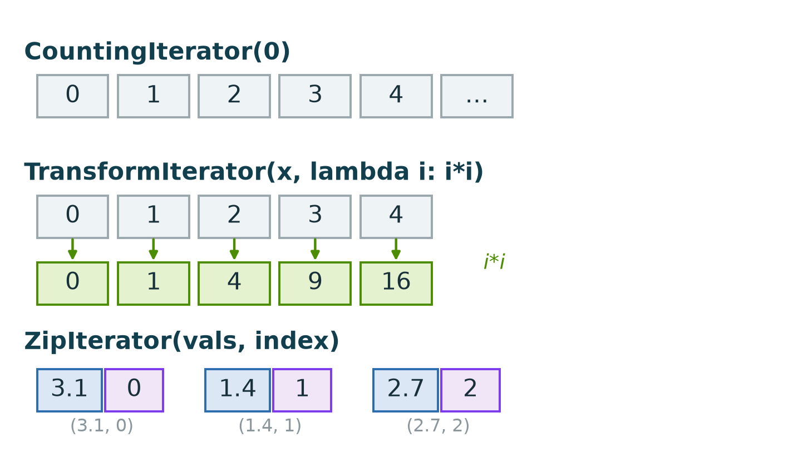

</div>
</div>


---

## `cuda.compute` features

<!--
And here is a corete example using iterators. 

In this example, we're computing the sum of squares of the sequence 0, 1, 2, 3 up to N. We do this using two iterators and one algorithm. The first iterator...
-->


<div class="cols">
<div>

- <span class="past">**Algorithms**: composable parallel building blocks (CUB and Thrust)</span>
- <span class="cur">**Iterators**: lazy sequences, computed on the fly, that fuse a step into the next algorithm</span>

</div>
<div>

```python
from cuda.compute import (CountingIterator, TransformIterator,
                          reduce_into, OpKind)
import numpy as np

counting = CountingIterator(np.int32(0))          # 0, 1, 2, 3, ...
squares  = TransformIterator(counting, lambda i: i * i)

# sum of the first n squares
reduce_into(d_in=squares, d_out=out, num_items=n,
            op=OpKind.PLUS, h_init=np.zeros(1, np.int64))

# no array was ever materialized: the integers and their
# squares are produced on the fly, inside the reduction

assert out[0] == sum(k * k for k in range(n))   # 1**2 + 2**2 + ... + (n-1)**2
```

</div>
</div>


---

## `cuda.compute` features

<!--
Another important feature of cuda.compute is the ability to work with user-defined types.
These can be arbitrarily nested struct types.
So if you have data laid out as an array of structures, cuda.compute can work with that quite naturally.
In the code example, I have an array of pixels where each pixel is a compound data type composed
of RGB components. 
I can define a custom data type in cuda.compute using the gpu_struct deocrator.
Then, I can 


-->


<div class="cols">
<div>

- <span class="past">**Algorithms**: composable parallel building blocks (CUB and Thrust)</span>
- <span class="past">**Iterators**: lazy sequences, computed on the fly, that fuse a step into the next algorithm</span>
- <span class="cur">**Computation with arbitrary data types**</span>

</div>
<div>

```python
from cuda.compute import gpu_struct, unary_transform
import numpy as np

@gpu_struct
class Pixel:
    r: np.int32
    g: np.int32
    b: np.int32

def luminance(p: Pixel) -> np.int32:
    # ITU-R 601 luma
    return (299 * p.r + 587 * p.g + 114 * p.b) // 1000

# compute the luminance of each pixel:
unary_transform(d_in=d_rgb, d_out=gray, opp=luminance, num_items=n)
```

</div>
</div>


---

## `cuda.compute` features

<div class="cols">
<div>

- <span class="past">**Algorithms**: composable parallel building blocks (CUB and Thrust)</span>
- <span class="past">**Iterators**: lazy sequences, computed on the fly, that fuse a step into the next algorithm</span>
- <span class="past">**Computation with arbitrary data types**</span>
- <span class="cur">**JIT by default. Supports ahead-of-time compilation workflows.**</span>

</div>
<div>

<div class="aot-h">JIT: compile on first use</div>

```python
from cuda.compute import unary_transform

def square(v): return v * v

unary_transform(d_in=x, d_out=y, op=square, num_items=n)
unary_transform(d_in=x, d_out=y, op=square, num_items=n)   # again
```

<div class="note">1st call <span class="slow">1155 ms</span>, JIT compiles &nbsp;·&nbsp; 2nd call <span class="fast">0.17 ms</span>, cached</div>

<div class="aot-h aot-gap">Ahead of time: compile once, reuse</div>

```python
from cuda.compute import make_unary_transform, serialize

alg = make_unary_transform(d_in=x, d_out=y, op=square)
open("square.cccl", "wb").write(serialize(alg))
```

<div class="note"><b>serialize</b> the compiled kernel → a <b>230 KB</b> blob on disk</div>

```python
from cuda.compute import deserialize     # a later session

alg = deserialize(open("square.cccl", "rb").read())
alg(d_in=x, d_out=y, op=square, num_items=n)
```

<div class="note"><b>deserialize</b> → 1st call <span class="fast">3.3 ms</span> (<b>no JIT</b>) &nbsp;·&nbsp; 2nd call <span class="fast">0.13 ms</span>, cached</div>

</div>
</div>


---

## Awkward Array algorithms built with `cuda.compute`

<div class="cols">
<div>

- <span class="cur">**Awkward array layout**: ragged data stored as flat content and offsets buffers</span>

</div>
<div>


</div>
</div>


---

## Awkward Array algorithms built with `cuda.compute`

<div class="cols">
<div>

- <span class="past">**Awkward array layout**: ragged data stored as flat content and offsets buffers</span>
- <span class="cur">**Example**: `ak.argmin`</span>

</div>
<div>

```python
import awkward as ak

data = ak.Array([[3.1, 1.4], [], [9.0, 0.5, 2.2]])

# index of the minimum within each sublist
ak.argmin(data, axis=1)   # [1, None, 1]
```

</div>
</div>


---

## Awkward Array algorithms built with `cuda.compute`

<div class="cols">
<div>

- <span class="past">**Awkward array layout**: ragged data stored as flat content and offsets buffers</span>
- <span class="past">**Example**: `ak.argmin`</span>
- <span class="cur">**Previous Awkward implementation**: a handwritten CUDA C++ kernel, three passes and about 150 lines</span>

</div>
<div>

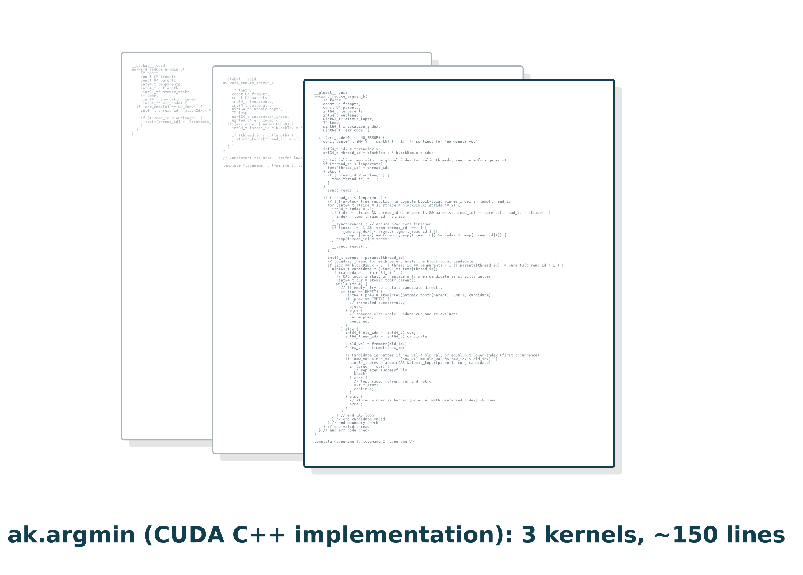

</div>
</div>


---

## Awkward Array algorithms built with `cuda.compute`

<div class="cols">
<div>

- <span class="past">**Awkward array layout**: ragged data stored as flat content and offsets buffers</span>
- <span class="past">**Example**: `ak.argmin`</span>
- <span class="past">**Previous Awkward implementation**: a handwritten CUDA C++ kernel, three passes and about 150 lines</span>
- <span class="cur">**Using `cuda.compute`**: the same reduction in a few lines of Python</span>

</div>
<div>

```python
def segment_argmin(seg_id):
    lo, hi = starts[seg_id], stops[seg_id]
    if lo == hi:
        return -1
    return np.argmin(content[lo:hi]) + lo

unary_transform(d_in=CountingIterator(0),
                d_out=result, op=segment_argmin,
                num_items=num_sublists)
```

<div class="aot-h">ak.argmin (cuda.compute): a few lines of pure Python</div>

</div>
</div>


---

## Awkward Array algorithms built with `cuda.compute`

<div class="cols">
<div>

- <span class="past">**Awkward array layout**: ragged data stored as flat content and offsets buffers</span>
- <span class="past">**Example**: `ak.argmin`</span>
- <span class="past">**Previous Awkward implementation**: a handwritten CUDA C++ kernel, three passes and about 150 lines</span>
- <span class="past">**Using `cuda.compute`**: the same reduction in a few lines of Python</span>
- <span class="cur">**Performance results**: identical output, and faster than the handwritten kernel</span>

</div>
<div>

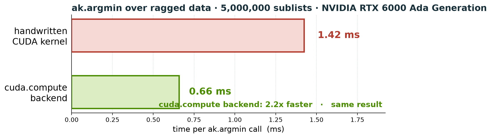

</div>
</div>


---

## Kernel fusion

<div class="cols">
<div>

- <span class="cur">**Kernel fusion** is key to optimizing memory traffic and reducing launch overhead</span>

</div>
<div>

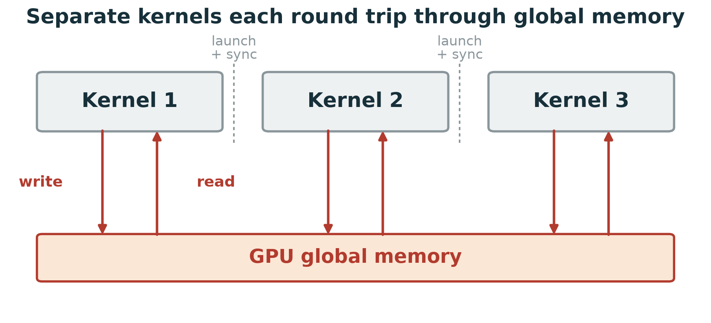

</div>
</div>


---

## Kernel fusion

<div class="cols">
<div>

- <span class="past">**Kernel fusion** is key to optimizing memory traffic and reducing launch overhead</span>
- <span class="cur">**Implicit vs explicit fusion**: `|x|` then `sum`, without materializing the intermediate</span>

</div>
<div>

<div class="aot-h">eager (cupy): materialize the intermediate</div>

```python
y = cp.abs(x).sum()
```

<div class="note"><span class="slow">3 kernels · 1.6 ms</span> &nbsp; <code>abs</code> writes <code>|x|</code> to memory, <code>sum</code> reads it back: 3x the traffic</div>

<div class="aot-h aot-gap">implicit fusion (torch.compile)</div>

```python
@torch.compile
def abs_sum(x):
    return torch.abs(x).sum()
```

<div class="note"><span class="fast">2 kernels · 0.57 ms</span> &nbsp; a compiler decides what fuses</div>

<div class="aot-h aot-gap">explicit fusion (cuda.compute)</div>

```python
absx = TransformIterator(x, lambda v: abs(v))
reduce_into(d_in=absx, d_out=out, op=OpKind.PLUS,
            determinism=Determinism.NOT_GUARANTEED, ...)
```

<div class="note"><span class="fast">1 kernel · 0.57 ms</span> &nbsp; you compose the fusion, on any data</div>

<div class="note" style="margin-top:16px"><b>100 M values · RTX PRO 6000 Blackwell</b></div>

</div>
</div>


---

## Kernel fusion

<div class="cols">
<div>

- <span class="past">**Kernel fusion** is key to optimizing memory traffic and reducing launch overhead</span>
- <span class="past">**Implicit vs explicit fusion**: `|x|` then `sum`, without materializing the intermediate</span>
- <span class="cur">**A real workflow**: dimuon invariant mass, one line of Awkward</span>

</div>
<div>

```python
mu1, mu2 = ak.unzip(ak.combinations(muons, 2))

mass = np.sqrt(
    2 * mu1.pt * mu2.pt
    * (np.cosh(mu1.eta - mu2.eta)
     - np.cos (mu1.phi - mu2.phi)))
```

<div class="note">each operation is one or more separate kernels</div>

</div>
</div>


---

## Kernel fusion

<div class="cols">
<div>

- <span class="past">**Kernel fusion** is key to optimizing memory traffic and reducing launch overhead</span>
- <span class="past">**Implicit vs explicit fusion**: `|x|` then `sum`, without materializing the intermediate</span>
- <span class="past">**A real workflow**: dimuon invariant mass, one line of Awkward</span>
- <span class="cur">**Fused with cuda.compute**: the whole formula in one `binary_transform`</span>

</div>
<div>

```python
@gpu_struct
class Muon:
    pt: float32
    eta: float32
    phi: float32
    charge: int32

def mass(m1, m2):
    return (2 * m1.pt * m2.pt * (cosh(m1.eta - m2.eta)
                              -  cos(m1.phi - m2.phi))) ** 0.5

# gather each field by pair index, zip into a Muon: all lazy
muons1 = PermutationIterator(ZipIterator(pt1, eta1, phi1, q1), idx1)
muons2 = PermutationIterator(ZipIterator(pt2, eta2, phi2, q2), idx2)

binary_transform(d_in1=muons1, d_in2=muons2,
                 d_out=out, op=mass, num_items=n)
```

<div class="note">one fused kernel - no intermediate memory allocations</div>

</div>
</div>


---

## Kernel fusion

<div class="cols">
<div>

- <span class="past">**Kernel fusion** is key to optimizing memory traffic and reducing launch overhead</span>
- <span class="past">**Implicit vs explicit fusion**: `|x|` then `sum`, without materializing the intermediate</span>
- <span class="past">**A real workflow**: dimuon invariant mass, one line of Awkward</span>
- <span class="cur">**Fused with cuda.compute**: the whole formula in one `binary_transform`</span>

</div>
<div>

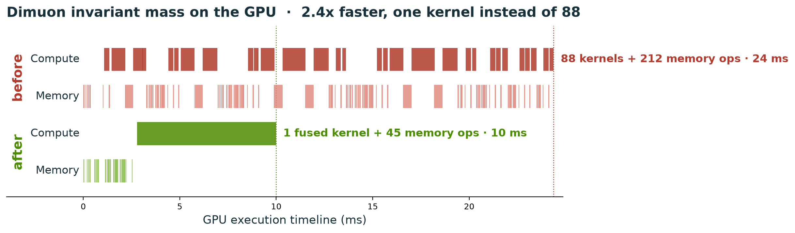

</div>
</div>


---

## Awkward Array: present and future

<div class="cols">
<div>

- <span class="cur">**Nearly all CUDA kernels** ported from CUDA C++ to pure Python</span>

</div>
<div>

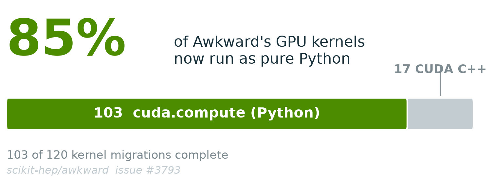

- 114 kernels use **cuda.compute**
- Remaining **17 kernels are already implemented**

<div style="font-size: 20px; color: #4c8c00">Maxym Naumchyk</div>

</div>
</div>


---

## Awkward Array: present and future

<div class="cols">
<div>

- <span class="past">**Nearly all CUDA kernels** ported from CUDA C++ to pure Python</span>
- <span class="cur">**Rearchitecting for the GPU**: moving from `parents` to `offsets` also **speeds up the CPU**</span>

</div>
<div>

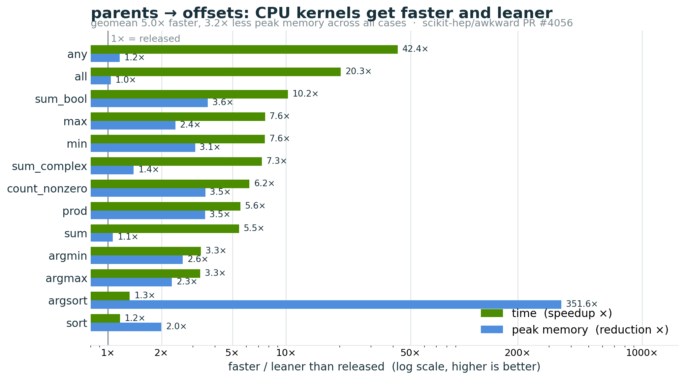

<div class="note">the same <code>offsets</code> layout that maps ragged data onto GPU segmented algorithms also sped up Awkward's CPU kernels — <b>geomean 5× faster, 3.2× leaner</b> (awkward #4056)</div>

</div>
</div>


---

## Awkward Array: present and future

<div class="cols">
<div>

- <span class="past">**Nearly all CUDA kernels** ported from CUDA C++ to pure Python</span>
- <span class="past">**Rearchitecting for the GPU**: moving from `parents` to `offsets` also **speeds up the CPU**</span>
- <span class="cur">**Awkward on CUDA is now even faster**</span>

</div>
<div>

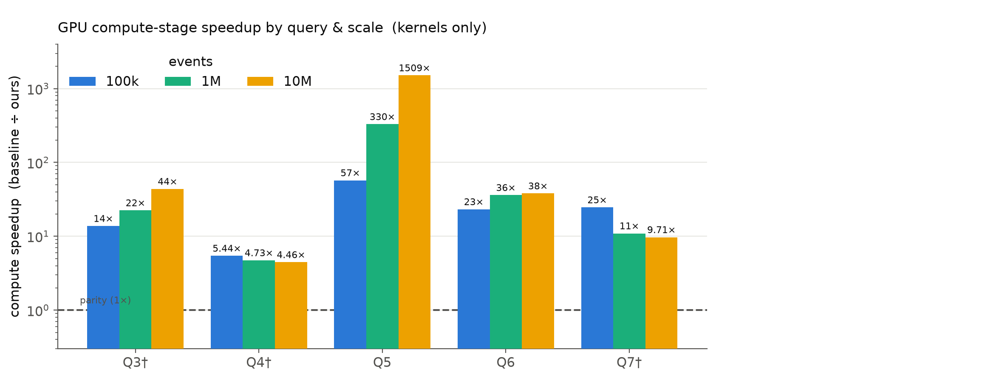

<div class="note">Speedups for high-energy physics (HEP) queries in the ADL benchmark, <b>GPU to GPU</b> (previous CUDA C++ kernels vs cuda.compute), compute stage only</div>

</div>
</div>

---

## Awkward Array: present and future

<div class="cols">
<div>

- <span class="past">**Nearly all CUDA kernels** ported from CUDA C++ to pure Python</span>
- <span class="past">**Rearchitecting for the GPU**: moving from `parents` to `offsets` also **speeds up the CPU**</span>
- <span class="past">**Awkward on CUDA is now even faster**</span>
- <span class="cur">**What is next: lazy execution**</span>

</div>
<div>

```python
la = lazy(array)             # wrap: nothing runs yet

# a chain of elementwise ops, written normally
expr = la
for _ in range(16):
    expr = expr * 1.001 + 0.5

expr.compute(fuse=True)      # whole chain -> ONE kernel
```

<div class="note">the lazy layer fuses a whole chain of element-wise ops into one kernel automatically, <b>up to ~90x faster</b> than running each eagerly</div>

</div>
</div>

<!-- ASHWIN:END -->

---

## Awkward Array: present and future

<div class="cols">
<div>

- <span class="past">**Nearly all CUDA kernels** ported from CUDA C++ to pure Python</span>
- <span class="past">**From `parents` to `offsets`**: the ragged layout maps straight onto segmented algorithms</span>
- <span class="past">**Awkward on CUDA is now even faster**</span>
- <span class="past">**What is next: lazy execution**</span>
    - <span class="cur">The map is fused into the reduction — no intermediate buffers</span>

</div>
<div>


<div class="note">Eager time rises linearly (2→34 ms); fused time is flat (~0.4 ms). <b>"That flat line is fusion."</b></div>

</div>
</div>

---

## Awkward Array: present and future

<div class="cols">
<div>

- <span class="past">**Nearly all CUDA kernels** ported from CUDA C++ to pure Python</span>
- <span class="past">**From `parents` to `offsets`**: the ragged layout maps straight onto segmented algorithms</span>
- <span class="past">**Awkward on CUDA is now even faster**</span>
- <span class="past">**What is next: lazy execution**</span>
    - <span class="past">The map is fused into the reduction — no intermediate buffers</span>
    - <span class="cur">GPU dispatch-bound vs. CPU bandwidth-bound</span>

</div>
<div>


<div class="note">GPU up to ~90× and size-independent; CPU 2–8×</div>

</div>
</div>

---

## Awkward Array: present and future

<div class="cols">
<div>

- <span class="past">**Nearly all CUDA kernels** ported from CUDA C++ to pure Python</span>
- <span class="past">**From `parents` to `offsets`**: the ragged layout maps straight onto segmented algorithms</span>
- <span class="past">**Awkward on CUDA is now even faster**</span>
- <span class="past">**What is next: lazy execution**</span>
    - <span class="past">The map is fused into the reduction — no intermediate buffers</span>
    - <span class="past">GPU dispatch-bound vs. CPU bandwidth-bound</span>
    - <span class="cur">Transform and reduction execute as a single fused kernel</span>

</div>
<div>


</div>
</div>

---

## Eager vs Fused Execution

<style scoped>
.diagrams { display: grid; grid-template-columns: 1fr 1fr; gap: 34px; align-items: start; flex: 0 0 auto; }
.diagrams pre { font-size: 17px; }
.diagrams h3 { margin: 0 0 4px 0; color: #013243; }
.bottom { display: grid; grid-template-columns: 1.1fr 0.9fr; gap: 34px; align-items: center; flex: 1 1 auto; margin-top: 10px; }
.bottom > div:last-child { display: flex; flex-direction: column; justify-content: flex-start; }
.bottom ul { margin: 0; }
.bottom li { margin: 12px 0; }
</style>

<div class="diagrams">
<div>

### Eager

```
Kernel
↓
Memory
↓
Kernel
↓
Memory
↓
Kernel
```

</div>
<div>

### Lazy + Fusion

```
Expression Graph
↓
One CUDA Kernel
```

</div>
</div>

<div class="bottom">
<div>


<div class="note">nsys-verified launch count: N element-wise ops → 1 fused kernel.</div>

</div>
<div>

- <span class="cur">fewer launches</span>
- <span class="cur">less global memory traffic</span>
- <span class="cur">better cache locality</span>

</div>
</div>

---

## How it works

<div class="cols">
<div>

- <span class="cur">**Introspection**: `fusion_stats()` and `visualize(fused=True)` make the compiler's decision visible</span>

</div>
<div>

```python
la = ak.cuda.lazy(arr)
t  = la * 2 + 1
pipeline = t.filter(t > 5)

pipeline.fusion_stats()
# -> {'elementwise_before': 3, 'fused_regions': 2, 'materialized': 7}

print(pipeline.visualize(fused=True))
# FilterNode(op=filter)
#   Input:
#     FusedNode(leaves=3, expr='(($0 * $1) + $2)')      <- scale+shift, one kernel
#   Condition/Mask:
#     FusedNode(leaves=2, expr='($0 > $1)')             <- compare, one kernel
```

<div class="note" style="margin-top:14px">Fusion collapses the element-wise regions; the structural <code>filter</code> stays a boundary. The shared <code>t = la*2+1</code> is computed <b>once</b> and reused by both the filter input and the condition (single-use fusion = free CSE).</div>

</div>
</div>

---

## How it works

<div class="cols">
<div>

- <span class="past">**Introspection**: `fusion_stats()` and `visualize(fused=True)` make the compiler's decision visible</span>
- <span class="cur">**Transparent (debug mode)**: `fuse=True` (default) and `fuse=False` are numerically identical; the no-fuse path keeps every intermediate visible for debugging</span>

</div>
<div>

```python
expr = (ak.cuda.lazy(arr) * 2 + 1) * 3

expr.compute(fuse=True)    # one fused kernel
expr.compute(fuse=False)   # per-op interpreter — identical result
# both -> [[9, 15, 21], [27, 33], [39, 45, 51, 57]]
```

<div class="note" style="margin-top:14px">Fusion is a fast path, never a correctness dependency — anything it can't fuse (strings, regular/indexed layouts, mixed backends) falls back to the eager path automatically, with the same answer.</div>

</div>
</div>


---

## Performance

<div class="cols">
<div>

- <span class="cur">Runtime vs dataset size</span>

</div>
<div>

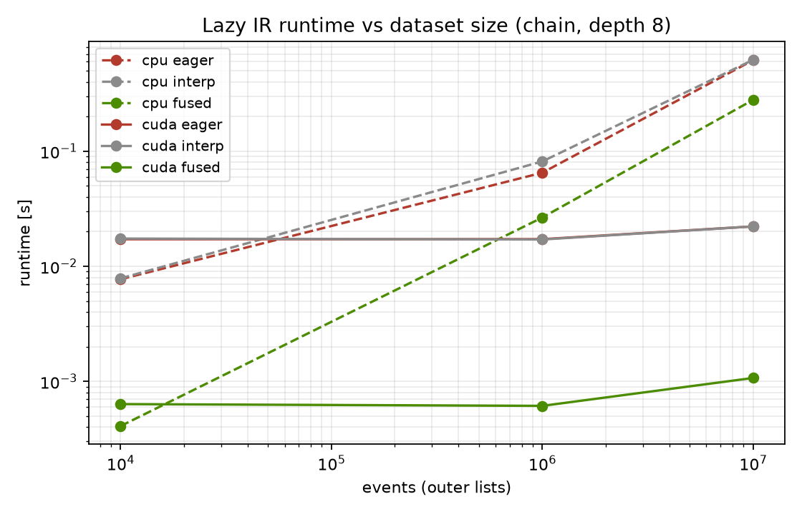

<div class="note">Eager runtime grows with the dataset — each op is a separate kernel and memory pass. The fused path stays far lower and flatter: the whole chain runs as one kernel, so the gap widens as data grows.</div>

</div>
</div>

---

## Performance

<div class="cols">
<div>

- <span class="past">Runtime vs dataset size</span>
- <span class="cur">GPU speedup</span>

</div>
<div>

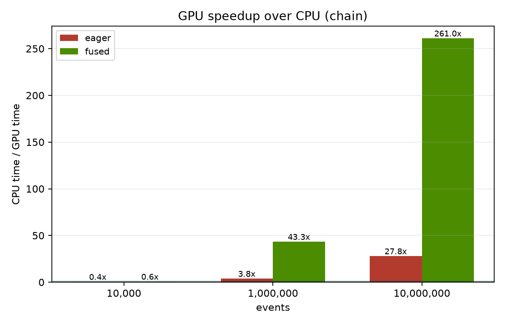

<div class="note">Speedup over the eager path climbs with dataset size and then plateaus — once the GPU is saturated, fusion's win is size-independent (dispatch-bound, not bandwidth-bound).</div>

</div>
</div>

---

## Performance

<div class="cols">
<div>

- <span class="past">Runtime vs dataset size</span>
- <span class="past">GPU speedup</span>
- <span class="cur">Kernel launch count</span>

</div>
<div>

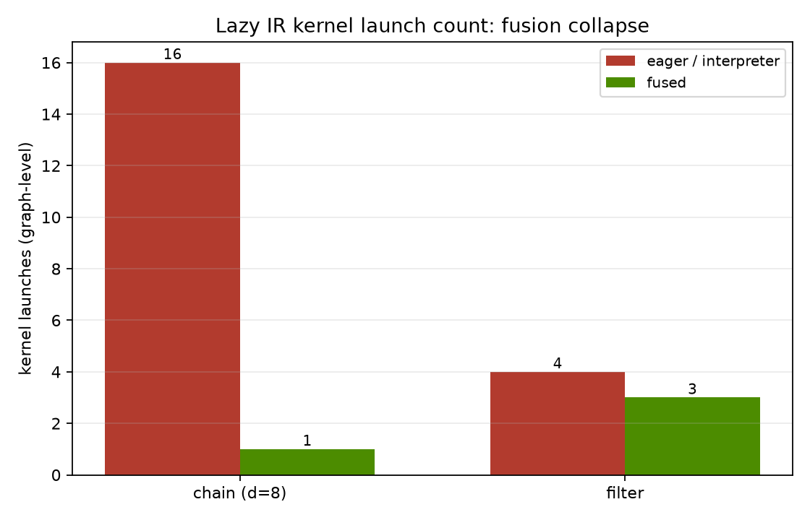

<div class="note">The eager path launches one kernel per op, so the count rises with chain length; fusion collapses the whole chain to a single launch — the source of both the speedup and the lower overhead.</div>

</div>
</div>

---

## Performance

<div class="cols">
<div>

- <span class="past">Runtime vs dataset size</span>
- <span class="past">GPU speedup</span>
- <span class="past">Kernel launch count</span>
- <span class="cur">Memory traffic</span>

<div class="note" style="margin-top:22px"><b>Key observation:</b> fusion becomes increasingly beneficial as workloads grow.</div>

</div>
<div>

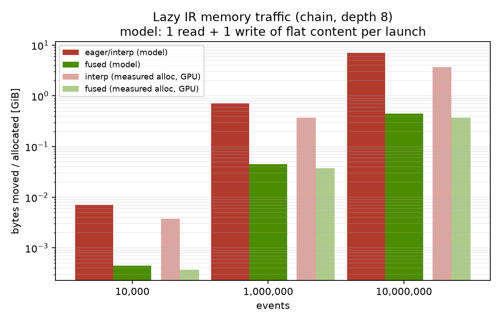

<div class="note">Eager writes every intermediate back to global memory and reads it again; fusion keeps intermediates in registers, so total bytes moved stays flat as the chain grows.</div>

</div>
</div>


---


<!-- _class: challenge -->

## The future

<div class="challenge-question">

High-performance GPU programming becomes accessible to scientific Python users.

</div>

<style>
section.challenge {
  display: flex;
  flex-direction: column;
  justify-content: center !important;
  align-items: center;
  text-align: center;
}

section.challenge h1 {
  margin-bottom: 48px;
}

.challenge-question {
  max-width: 980px;
  font-size: 42px;
  line-height: 1.25;
  font-weight: 700;
  color: #123f4d;
}
</style>


---

## Conclusions

- <span class="cur">One program, not many kernels — 32 ops → 1 kernel, ~90× faster.</span>

---


## Conclusions

- <span class="past">One program, not many kernels — 32 ops → 1 kernel, ~90× faster.</span>

- <span class="cur">Python replaced CUDA C++ — and won.</span>

---


## Conclusions

- <span class="past">One program, not many kernels — 32 ops → 1 kernel, ~90× faster.</span>

- <span class="past">Python replaced CUDA C++ — and won.</span>

- <span class="cur"> GPU‑first design sped up CPU too (~4×).</span>


---

## Conclusions

- <span class="past">One program, not many kernels — 32 ops → 1 kernel, ~90× faster.</span>

- <span class="past">Python replaced CUDA C++ — and won.</span>

- <span class="past"> GPU‑first design sped up CPU too (~4×).</span>

- <span class="cur">Awkward API unchanged — no kernels, no memory management.</span>

---

## Thank You


### Questions?

Acknowledgements

• Awkward Array contributors
• NVIDIA CUDA Python & CCCL team
• IRIS-HEP
• Princeton University

Thank you!

https://github.com/scikit-hep/awkward

https://awkward-array.org

<div style="display:flex; align-items:center; gap:34px; margin-top:16px;">


</div>

<div style="display:flex; align-items:flex-start; gap:16px; margin-top:16px;">

<span style="font-size:11px; color:#45555b; white-space:nowrap;">This work was supported in part by the U.S. National Science Foundation through IRIS-HEP (NSF OAC-1836650, OAC-1450377, OAC-2103945, PHY-2121686, PHY-2323298)</span>
</div>


